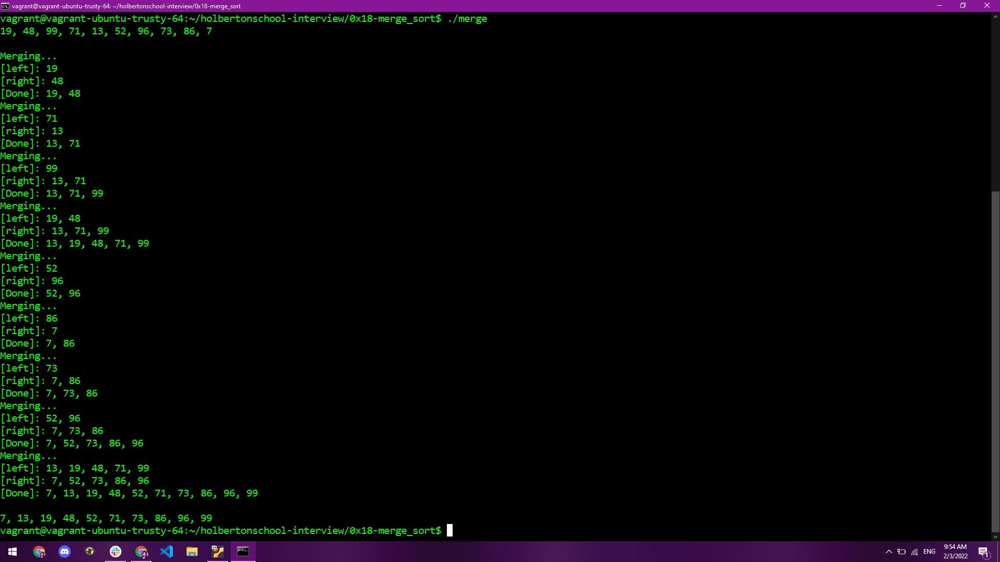

# holbertonschool-interview
## About Me
&ensp;&ensp;&ensp;&ensp;[Selidex](https://www.linkedin.com/in/selidex-parnell-6469a613b/) here, I am a Holberton student/soon to be grad, and an aspiring game developer. One of my bigger projects was a 
[musuem trivia](https://github.com/BenDoschGit/scavenger_hunt_and_trivia) application for android tablets, though I will soon be adding a couple of unity based games to my portfolio as well. If you want to get a hold of me you can always reach me at my Twitter, [@Selidex](https://twitter.com/Selidex).

## About the Repository
&ensp;&ensp;&ensp;&ensp;Rather than being a single project, this repository is a collection of smaller projects: common interview alghorithms that potential employers might use to determine if an applicant is suitable for the position. Since these mini projects are in different languages and cover all sorts of problems, it shows not just regular problem solving skills but also versitility in languages and mindset. 

## Algorithms 
Currently this repository has solutions for the following problems:
- Lockboxes
- Insert in sorted linked list
- Heap Insert
- Minimum Operations
- Sandpiles
- Linked list palindrome
- Linked list cycle
- Palindrome integer
- UTF-8 Validation
- 2048 (single line)
- N Queens
- Array to AVL
- Linear search in skip list
- Star Wars API
- Rain
- Heap Sort
- Advanced Binary Search
- Count it!
- Heap Extract
- Infinite Multiplication
- Rotate 2D Matrix
- Find the Loop
- Merge Sort

Future Problems that will be including in this repository include:
- Log Parsing
- Menger Sponge

&ensp;&ensp;&ensp;&ensp;There will be more projects added to this repository as time adds on, either from the disretion of Holberton curriculum, or individual algorithms that I later decide to tackle on my own.

## Challenges
&ensp;&ensp;&ensp;&ensp;Most of the problems were not in and of themselves challenging, especially once you knew the basic algorthim to solve the issue. Instead the most challenging part for several of these problems were fitting into specific constraints, such as Betty format's 40 line limit, or not using functions in standard libraries. I plan on coming back and tackling these problems either in a new language, without these additional constraints, or adding my own constraints to increase the challenge.
# Example Outputs
## Merge Sort

